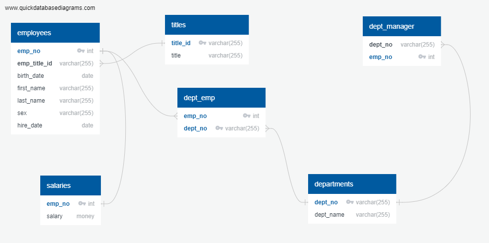
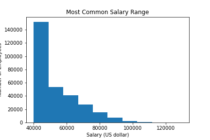
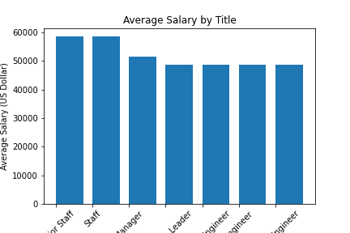

# SQL Employee Database: A Mystery in Two Parts


## Background

Our task is a research project on employees of the a corporation from the 1980s and 1990s. All that remain of the 
database of employees from that period are six CSV files, click [Data](EmployeeSQL/data/employees.csv) for sample file.
We will design tables to hold data in the CSVs, import the CSVs into a SQL database, and answer questions about the data. 
In other words, we will perform:
 1. Data Engineering
 2. Data Analysis

## Instructions

#### Data Modeling

Inspect the CSVs and sketch out an ERD of the tables. We used [QuickDBD](http://www.quickdatabasediagrams.com) website.

#### <a id="sql-erd"></a>SQL ERD


#### Data Engineering

* Used the information to create a table schema for each of the six CSV files. 
* Specifing data types, primary keys, foreign keys, and other constraints.

  * We created a composite key [Learn More](https://en.wikipedia.org/wiki/Compound_key). Which takes to primary keys in order to uniquely identify a row.
  * We created tables in the correct order to handle foreign keys.
  * Imported each CSV file into the corresponding SQL table.
  * Our DataBase is completed, we move to next phase.

#### <a id="table-schema"></a>Table Schema


#### Data Analysis

After completing the database, we used SQL query to do the following:

* Listed the details of each employee: employee number, last name, first name, sex, and salary.
* Listed first name, last name, and hire date for employees who were hired in 1986.
* Listed the manager of each department with the following information: department number, department name, the manager's employee number, last name, first name.
* Listed the department of each employee with the following information: employee number, last name, first name, and department name.
* Listed first name, last name, and sex for employees whose first name is "Hercules" and last names begin with "B."
* Listed all employees in the Sales department, including their employee number, last name, first name, and department name.
* Listed all employees in the Sales and Development departments, including their employee number, last name, first name, and department name.
* In descending order, listed the frequency count of employee last names, i.e., how many employees share each last name.
* Generate a visualization of the data.

#### <a id="sql-query"></a>SQL Query


After that we imported the SQL database into Pandas to do some charting to visualize our data.

* Created a histogram to visualize the most common salary ranges for employees.

#### <a id="histogram-chart"></a>Histogram Chart


* Created a bar chart of average salary by title.

#### <a id="bar-chart"></a>Bar Chart


## Epilogue

finaly we can look at employees by id, specially ID # 499942.
* As it turns out. It is all about April Foolsday.
```
emp_no	emp_title_id	birth_date	first_name	last_name	sex	hire_date
499942	e0004	   	1963-01-10	April		Foolsday	F	1997-02-10
```
